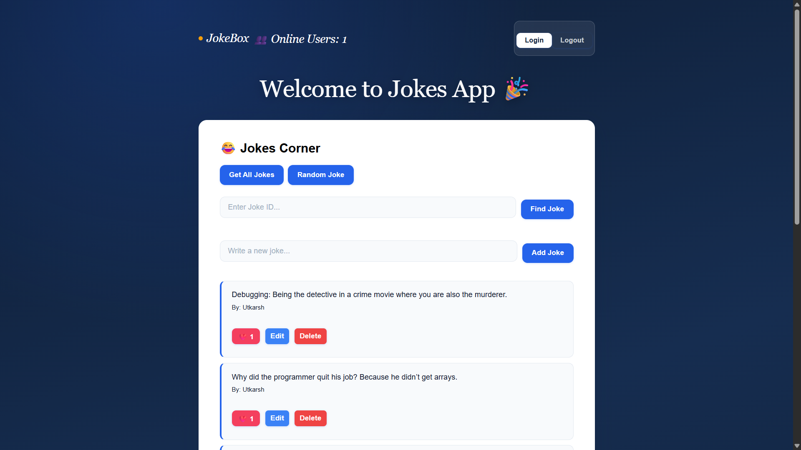
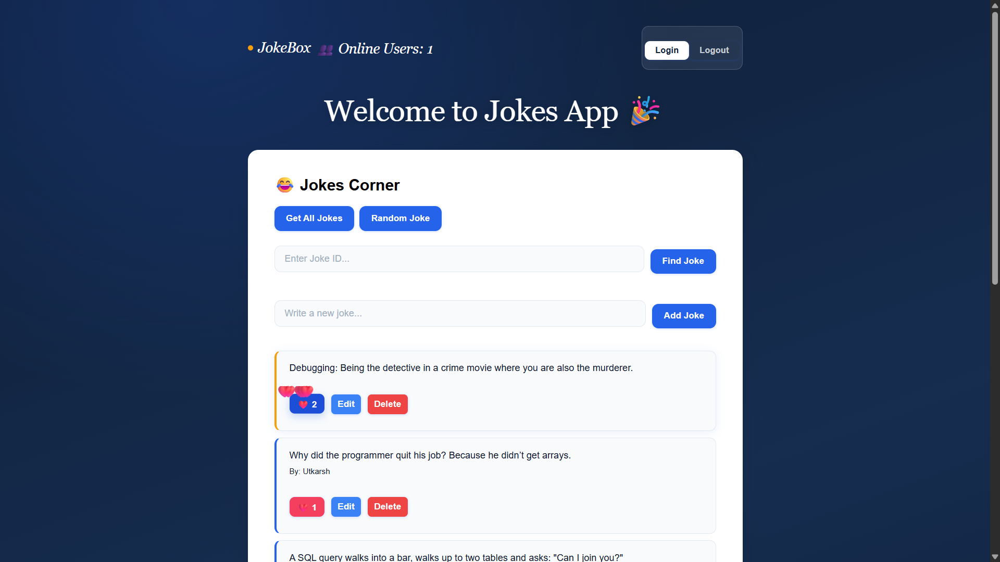
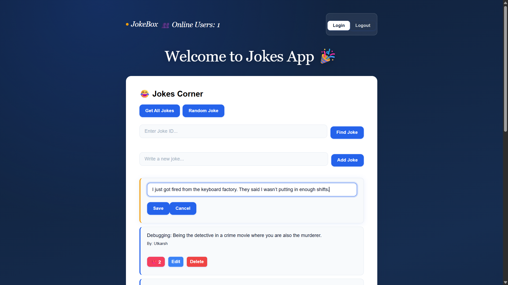
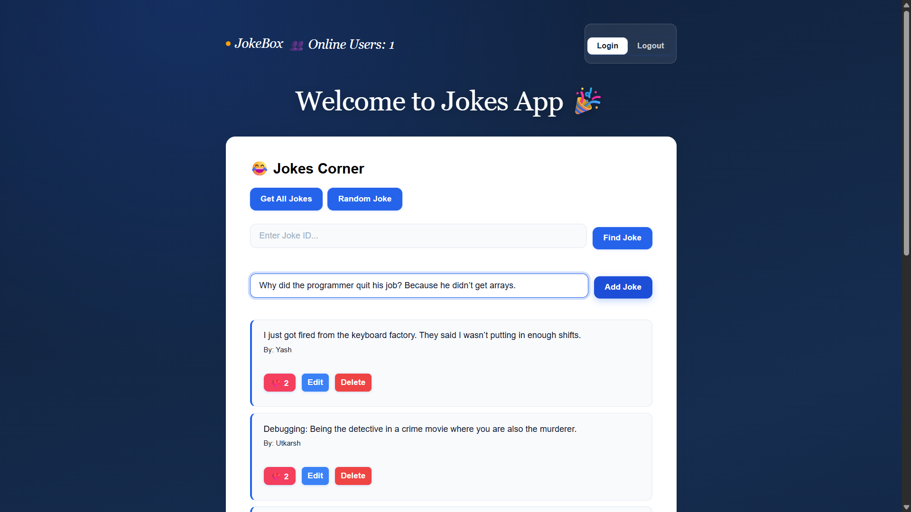

# 😂 JokeBox – Full Stack Real-Time Joke Sharing App


A **full-stack real-time web application** where users can **register, login, create jokes, edit them, like/unlike jokes, and see live updates instantly**.

The project demonstrates:

- REST API development
- JWT authentication
- PostgreSQL database design
- Real-time updates using WebSockets
- Secure backend practices
- Full stack deployment

---

# 🚀 Live Demo

### 🌐 Frontend
https://jokesapp26.vercel.app

### ⚡ Backend API
https://jokesapi-24iv.onrender.com

---

<!-- # 🎥 Demo

Add a short demo GIF here.

Example:


 -->


---

# 🖼 Screenshots

### Home Page





### Like System




### Joke Edit




### Add Joke





---

# 📌 Features

# 🔐 Authentication

- User registration
- User login
- JWT based authentication
- Secure password hashing with **bcrypt**
- Role-based authorization (admin / user)

---

# 🤣 Joke Management

Users can:

- View all jokes
- Fetch a random joke
- View joke by ID
- Add new jokes
- Edit their own jokes
- Delete jokes (author or admin)

---

# ✏️ Author-Only Edit Protection

Only the **author of the joke** can edit it.

Backend validation example:

```javascript
if (Number(joke.author_id) !== Number(req.user.id)) {
  return res.status(403).json({ message: "Unauthorized" });
}
```

Frontend also blocks unauthorized editing attempts.

---

# ❤️ Like / Unlike System

Users can **like or unlike jokes**.

Click again to remove the like.

This prevents **spam liking**.

---

# 🗄 Likes Table (Prevents Duplicate Likes)

```sql
CREATE TABLE likes (
  id SERIAL PRIMARY KEY,
  user_id INTEGER REFERENCES users(id) ON DELETE CASCADE,
  joke_id INTEGER REFERENCES jokes(id) ON DELETE CASCADE,
  UNIQUE(user_id, joke_id)
);
```

This ensures a user can **like a joke only once**.

---

# ⚡ Real-Time Updates (WebSockets)

The application uses **Socket.IO** to update like counts in real time.

When a user likes a joke:

1. Backend updates database
2. Socket.IO emits event
3. All connected clients receive the update instantly

Example:

```javascript
const io = req.app.get("io");

io.emit("likeUpdated", {
  jokeId,
  likes: updated.rows[0].likes
});
```

---

# 👥 Online Users Counter

The app shows **how many users are currently online**.

Example display:

```
👥 Online Users: 5
```

Backend socket logic:

```javascript
let onlineUsers = 0;

io.on("connection", (socket) => {

  onlineUsers++;

  io.emit("onlineUsers", onlineUsers);

  socket.on("disconnect", () => {
    onlineUsers--;
    io.emit("onlineUsers", onlineUsers);
  });

});
```

---

# 🛡 Security

Security measures implemented:

- JWT authentication
- Password hashing with bcrypt
- Protected routes
- Role-based access control
- **API rate limiting**

Example rate limiter:

```javascript
const apiLimiter = rateLimit({
  windowMs: 15 * 60 * 1000,
  max: 100,
});
```

---

# 🏗 Architecture

```
Frontend (React + Vite)
        │
        │ HTTP / WebSocket
        ▼
Backend (Node.js + Express + Socket.IO)
        │
        │ SQL Queries
        ▼
PostgreSQL Database
```

---

# 🛠 Tech Stack

## Frontend

- React
- Vite
- Axios
- React Router
- Socket.IO Client

## Backend

- Node.js
- Express.js
- JWT
- bcrypt
- Socket.IO
- express-rate-limit

## Database

- PostgreSQL

---

# 🌐 Deployment

| Service | Platform |
|-------|------|
| Frontend | Vercel |
| Backend | Render |
| Database | Render PostgreSQL |

---

# 🗄 Database Schema

## Users Table

```sql
CREATE TABLE users (
  id SERIAL PRIMARY KEY,
  name VARCHAR(100),
  email VARCHAR(100) UNIQUE NOT NULL,
  password TEXT NOT NULL,
  role VARCHAR(20) DEFAULT 'user',
  created_at TIMESTAMP DEFAULT CURRENT_TIMESTAMP
);
```

---

## Jokes Table

```sql
CREATE TABLE jokes (
  id SERIAL PRIMARY KEY,
  content TEXT NOT NULL,
  author_id INTEGER REFERENCES users(id) ON DELETE CASCADE,
  likes INTEGER DEFAULT 0,
  created_at TIMESTAMP DEFAULT CURRENT_TIMESTAMP
);
```

---

# ⚙️ Installation (Local Setup)

## 1️⃣ Clone Repository

```bash
git clone https://github.com/UtkarshSuman/API.git
cd API
```

---

## 2️⃣ Install Dependencies

### Backend

```bash
cd backend
npm install
```

### Frontend

```bash
cd frontend
npm install
```

---

# 3️⃣ Environment Variables

Create `.env` inside **backend**.

```
PORT=5000

JWT_SECRET=your_secret_key

CLIENT_URL=http://localhost:5173

DATABASE_URL=your_postgresql_connection_string
```

---

# 4️⃣ Run Backend

```bash
cd backend
npm run dev
```

---

# 5️⃣ Run Frontend

```bash
cd frontend
npm run dev
```

Frontend runs on:

```
http://localhost:5173
```

Backend runs on:

```
http://localhost:5000
```

---

# 📡 API Endpoints

## Authentication

### Register

```
POST /api/auth/register
```

### Login

```
POST /api/auth/login
```

---

# Jokes API

### Get all jokes

```
GET /api/jokes
```

### Get random joke

```
GET /api/jokes/random
```

### Get joke by ID

```
GET /api/jokes/:id
```

### Add joke

```
POST /api/jokes
```

### Edit joke

```
PUT /api/jokes/:id
```

### Delete joke

```
DELETE /api/jokes/:id
```

### Like / Unlike joke

```
POST /api/jokes/:id/like
```

---

# 📂 Folder Structure

```
API
│
├── backend
│   ├── config
│   │   └── db.js
│   ├── routes
│   │   ├── authRoutes.js
│   │   └── jokeRoutes.js
│   ├── middleware
│   │   └── authMiddleware.js
│   └── index.js
│
├── frontend
│   ├── components
│   ├── pages
│   ├── services
│   ├── socket.js
│   └── App.jsx
```

---

# 🧠 What I Learned

Through this project I learned:

- Building REST APIs using Express
- Implementing JWT authentication
- PostgreSQL schema design
- Real-time communication using WebSockets
- Preventing duplicate likes using database constraints
- Rate limiting APIs
- Full stack deployment using Render & Vercel

---

# 📌 Future Improvements

- Prevent multiple likes across devices
- Add comments to jokes
- Trending jokes algorithm
- Pagination
- User profiles
- Admin dashboard

---

# 👨‍💻 Author

**Utkarsh Suman**

GitHub  
https://github.com/UtkarshSuman

---

⭐ If you like this project, feel free to **star the repository**.